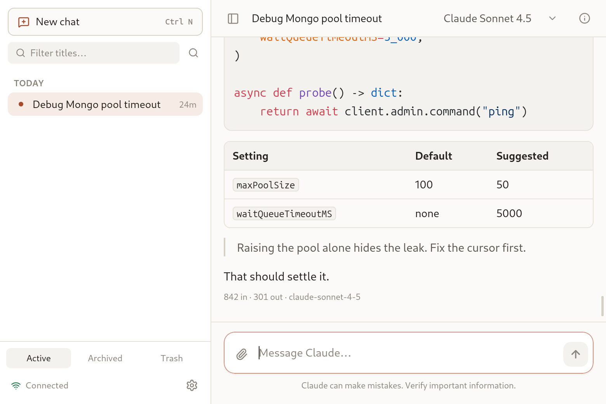
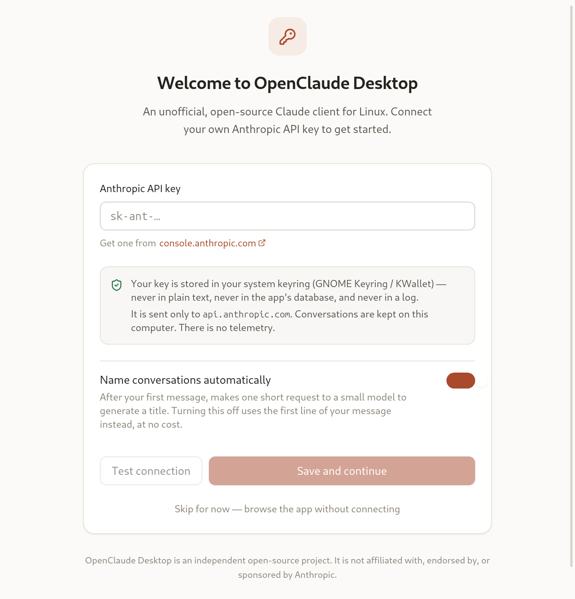

<div align="center">


# OpenClaude Desktop

**An unofficial, open-source Claude desktop client for Linux.**

Native-feeling, fast, local-first. Not a browser wrapper.

[](LICENSE)
[](#requirements)
[](https://tauri.app)

</div>

> [!IMPORTANT]
> **This is an independent open-source project.** It is not affiliated with,
> endorsed by, or sponsored by Anthropic. "Claude" is a trademark of
> Anthropic, PBC, used here only to describe what this client connects to.
> You need your own [Anthropic API key](https://console.anthropic.com/settings/keys);
> usage is billed to your account.

---

Claude has a first-class desktop app on macOS. Linux does not. This is an
attempt at one that Linux users would actually prefer to a browser tab —
built from scratch against the documented Anthropic API, with conversations
stored locally in SQLite and the API key in your system keyring.

It is **not** an Electron shell around claude.ai, and it does not touch
browser cookies or any private endpoint.

## Why it might be worth switching from a browser tab

- **Your history is yours** — a local SQLite database you can back up, grep,
  and export. Instant full-text search over every conversation you have ever
  had (Ctrl+K), including message bodies and attachment filenames.
- **It survives.** Close the app mid-answer, reboot, reopen: the conversation
  is exactly where you left it, and a reply cut short is marked *Interrupted*
  with **Continue** and **Retry** — never silently lost.
- **It is small.** ~11 MB binary, ~5 MB `.deb`, well under a second to a
  usable window, and a fraction of the memory of a Chromium-based app.
- **It does not phone home.** No telemetry, no analytics, no crash reporting,
  no update ping. The only outbound connection is to Anthropic's API when you
  send a message.
- **Projects** group conversations with standing instructions, a default
  model, and a working folder.
- **Branch any message** into a new conversation to explore an alternative
  without destroying the thread.

## Screenshots

| Conversation | First launch |
| --- | --- |
|  |  |

## Install

### Ubuntu / Debian (recommended)

```bash
sudo apt install ./OpenClaude\ Desktop_0.1.0_amd64.deb
```

### Without root

If you cannot (or would rather not) use `sudo`, the same `.deb` can be
unpacked into your home directory — its only dependencies are WebKitGTK,
GTK 3 and libayatana-appindicator, which a desktop system already has:

```bash
./scripts/install-user.sh                 # installs into ~/.local
./scripts/install-user.sh --uninstall     # and removes it again
```

This puts the binary in `~/.local/bin`, registers a launcher in
`~/.local/share/applications`, and installs the full icon set, so it shows up
in your application menu like any other app.

### AppImage (any distribution)

```bash
chmod +x OpenClaude\ Desktop_0.1.0_amd64.AppImage
./OpenClaude\ Desktop_0.1.0_amd64.AppImage
```

On Ubuntu 24.04, AppImages need FUSE 2: `sudo apt install libfuse2t64`, or
run with `--appimage-extract-and-run`.

### Requirements

Ubuntu 24.04+, Debian 13+, Fedora 39+, Arch, or anything else with
**WebKitGTK 4.1**. Distributions carrying only webkit2gtk 4.0 (Ubuntu 22.04,
Debian 11) cannot run this — a Tauri 2 constraint, not a choice.

On first launch you will be asked for an Anthropic API key. It goes into your
system keyring and nowhere else.

## Features

**Conversation**
Streaming replies · GitHub-flavoured Markdown · syntax highlighting for 48
languages, lazily loaded · copy / word-wrap / save on every code block ·
tables, task lists, blockquotes · collapsible extended thinking · stop
generation (Esc) · retry and continue · branch from any message

**Organisation**
Projects with standing instructions, default model and working folder ·
pin, archive, and a trash you can undo from · automatic titles · rename ·
duplicate · export to Markdown, JSON or plain text

**Attachments**
Drag and drop · paste images from the clipboard · file picker · text, source
code, JSON, CSV, Markdown, images and PDFs · validated against the API's
limits *before* sending, with a readable error rather than an opaque 413 ·
content-addressed and deduplicated on disk

**Search**
SQLite FTS5 over titles, message bodies and filenames · results as you type ·
stays instant at ten thousand conversations

**Desktop**
Light / dark / system themes that follow your desktop · desktop notifications
when a long reply lands while you are elsewhere · window state restored ·
`.desktop` entry and AppStream metadata · full keyboard control

**Settings**
General · Appearance · Claude · MCP · Notifications · Shortcuts · Privacy ·
Advanced — including database backup, integrity check, and an explicit,
editable pricing table for optional cost estimates.

## Keyboard shortcuts

| | |
| --- | --- |
| `Ctrl+N` | New conversation |
| `Ctrl+K` | Search everything |
| `Ctrl+Shift+P` | Command palette |
| `Ctrl+B` | Toggle sidebar |
| `Ctrl+,` | Settings |
| `Ctrl+/` | Shortcut help |
| `Ctrl+L` | Focus the conversation filter |
| `Ctrl+Shift+N` | New project |
| `Ctrl+Shift+C` | Copy the last reply |
| `Enter` / `Shift+Enter` | Send / newline (swappable) |
| `Esc` | Stop generating, or close an overlay |

## Where things live

Standard XDG locations, so backups and dotfile managers just work:

```
~/.local/share/openclaude/     database and attachments  (0700)
~/.config/openclaude/          configuration and window state
~/.local/state/openclaude/     logs
~/.cache/openclaude/           regenerable caches
```

The API key is in your **system keyring**, never in any of these.

## Privacy and security

- The API key is stored via the Secret Service API (GNOME Keyring, KWallet).
  **There is deliberately no IPC command that can read it back** — the UI can
  set, test and delete a key, and ask whether one exists, never retrieve one.
- All networking happens in the Rust process. The web layer's
  `connect-src` is `'self'`, so the UI *cannot* make an outbound request —
  which means prompt-injected content has nowhere to send your conversation.
- Model output is rendered without raw HTML (`rehype-raw` is not a
  dependency), and links are handed to your browser only for http/https/mailto.
- No telemetry of any kind. There is no setting to turn off, because there is
  no code.

Details, including the known limitations, are in
[docs/SECURITY-MODEL.md](docs/SECURITY-MODEL.md).

## Building from source

```bash
git clone https://github.com/openclaude/openclaude
cd openclaude
./scripts/setup-deps.sh      # WebKitGTK toolchain (needs sudo)
npm install
npm run app:dev              # development, with hot reload
./scripts/build-linux.sh     # .deb + AppImage
```

Needs Rust 1.77+ and Node 18.18+ (20+ recommended).
See [docs/DEVELOPMENT.md](docs/DEVELOPMENT.md).

## Troubleshooting

**Blank or white window.** WebKitGTK's compositing does not get on with some
drivers:

```bash
WEBKIT_DISABLE_COMPOSITING_MODE=1 openclaude
```

**"Key not saved" in the sidebar.** No Secret Service is reachable, so the key
is held for this session only. Start `gnome-keyring-daemon`, or install a
keyring for your desktop. We will not silently write it to disk.

**AppImage fails with a FUSE error.** `sudo apt install libfuse2t64`, or run
with `--appimage-extract-and-run`.

**Search looks stale.** Settings → Advanced → Rebuild search index.

## Documentation

| | |
| --- | --- |
| [Architecture](docs/ARCHITECTURE.md) | Layers, and why Tauri over Electron |
| [Schema](docs/SCHEMA.md) | Tables, FTS, migrations |
| [Streaming](docs/STREAMING.md) | SSE pipeline, durability, recovery |
| [Security model](docs/SECURITY-MODEL.md) | Trust boundaries, key handling |
| [Wireframes](docs/UI-WIREFRAMES.md) | Screen layouts |
| [Packaging](docs/PACKAGING.md) | Bundles and releases |
| [Linux risks](docs/LINUX-RISKS.md) | What breaks on real machines |
| [Roadmap](docs/ROADMAP.md) | Built, next, and deliberately not planned |

## Status

**0.1.0 — Phase 1 complete and usable as a daily driver.**

Next up: system tray, global quick-chat, conversation tabs, split view, then
MCP with a real permission system. Then the interesting one — running Claude
Code against a project's folder from inside the same sidebar. See the
[roadmap](docs/ROADMAP.md).

## Contributing

Issues and pull requests are welcome — see [CONTRIBUTING.md](CONTRIBUTING.md).
Good first issues are tagged. The test suite runs without an API key and
never makes a real network call; please keep it that way.

## Licence

[Apache-2.0](LICENSE).
